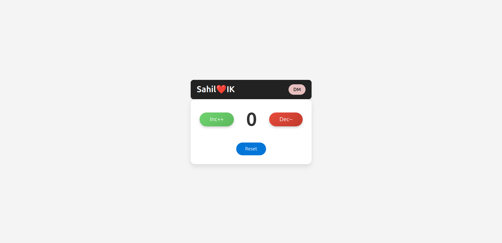

# ❤️ Counter App

A simple and fun **Counter App** built using **HTML**, **CSS**, and **Vanilla JavaScript**.  
Created with ❤️ by **SahilIK**.

---

## 📸 Preview

---

## 🌟 Live Demo

🚀 [Click here to try it out](https://workmdirfan29.github.io/Counter_App/) *(Add your GitHub Pages or live URL here)*

---

##  About the Project

The **Counter App** is a minimalistic tool that lets you:

- ➕ Increase the counter  
- ➖ Decrease the counter  
- 🔁 Reset the counter  
- 🌙 Toggle **Dark Mode** with the "DM" button  

Whether you're tracking something or just playing with code, this little app is built to be responsive, fast, and lightweight.

---

## ✨ Features

- ✅ Clean and intuitive UI  
- ✅ Live counter updates  
- ✅ Fully responsive  
- ✅ Toggle between light/dark mode  
- ✅ 100% Vanilla JS — No external libraries

---

